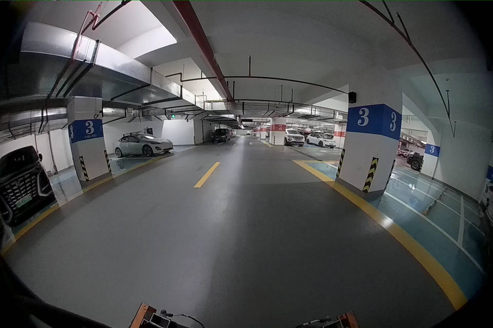
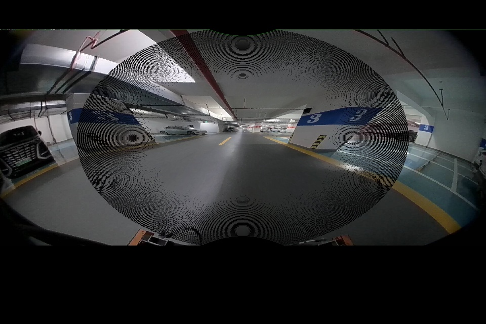
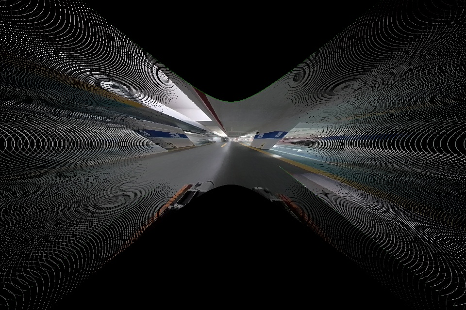
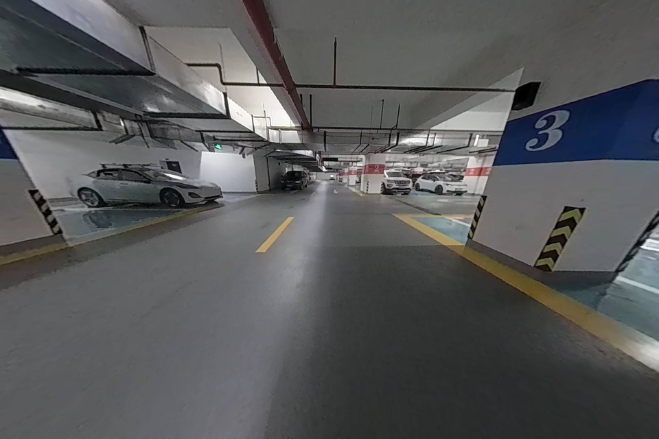

# Fisheye-Undistortion
This is a fisheye undistortion project.

The methods include:

    1. Opencv fisheye undistort method by points.
    2. Custom fisheye undistort method by points.
    3. Opencv fisheye undistort method by image.

## Demo
It includes example image for validate these methods.

### Original fisheye image

<!--  -->

### 1. Opencv fisheye undistort method by points.

### 2. Custom fisheye undistort method by points.

### 3. Opencv fisheye undistort method by image.

